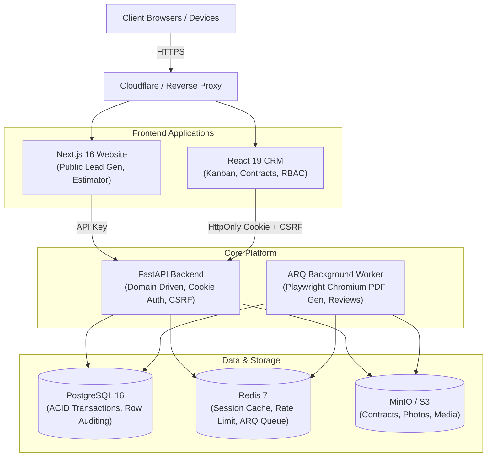

<div align="center">

# Rise Up Roofing & Construction — Enterprise Monorepo

**Production-Grade Platform: High-Performance Backend API, Modern React CRM, and Public Marketing Site**

[](https://fastapi.tiangolo.com)
[](https://react.dev)
[](https://www.typescriptlang.org)
[](https://www.postgresql.org)
[](https://redis.io)
[](https://www.docker.com)

</div>

---

## 1. System Overview

Rise Up Roofing & Construction operates a unified, hardened digital infrastructure designed to power roofing and construction operations across San Diego County.



---

## 2. Repository Layout

```
riseup-roofing/
├── backend/                  # FastAPI Application, Domain Models & Migrations
│   ├── alembic/              # Database schema migrations
│   ├── app/
│   │   ├── api/              # Routers (admin, public, developer)
│   │   ├── core/             # Security, CSRF, permissions, database, config
│   │   ├── domain/           # DDD Domain entities, aggregates & rules
│   │   ├── middlewares/      # Auth, security headers, rate limiting, telemetry
│   │   └── tasks/            # ARQ background worker and cron jobs
│   ├── Dockerfile            # Hardened multi-stage non-root runtime image
│   ├── Dockerfile.worker     # Isolated Chromium worker image
│   ├── docker-compose.yml    # Development stack
│   ├── docker-compose.prod.yml # Hardened production stack
│   └── tests/                # 350+ Pytest tests, perf load tests, authz matrix
│
├── crm/                      # Staff Backoffice Single Page Application
│   ├── src/
│   │   ├── components/       # UI components (Pipeline, Contracts, Leads, Clients)
│   │   ├── context/          # AuthContext (cookie hydration), CompanyContext
│   │   ├── features/         # Domain-sliced business workflows
│   │   ├── shared/           # API clients, design tokens, UI primitives
│   │   └── lib/              # Client state, structured logger, chunk reload
│   ├── vercel.json           # Restrictive CSP and defensive HTTP headers
│   └── package.json          # Vite, Vitest, Tailwind CSS v4, TypeScript
│
├── website/                  # Public Next.js Marketing Portal & Estimator
│
├── docs/                     # Architectural Documentation & Operational Runbooks
│   ├── architecture/         # System diagrams, auth specs, backend & frontend rules
│   ├── decisions/            # Architecture Decision Records (ADRs)
│   └── ops/                  # Runbooks: deploy, rollback, secret rotation, backups
│
├── plans/                    # 10/10 Architecture & Security Engineering Roadmaps
└── scripts/                  # Quality ratchet, backup restore verification
```

---

## 3. Quick Start (Development)

### Prerequisites
- Docker & Docker Compose
- Node.js >= 20, npm >= 10
- Python 3.12+ (uv or venv)

### 1. Boot Core Infrastructure & API
```bash
# Start PostgreSQL, Redis, MinIO, FastAPI, and ARQ Worker
cd backend
docker compose up -d

# Check service health
curl -f http://localhost:8000/health
```

### 2. Boot CRM Backoffice
```bash
cd crm
npm install
npm run dev
# CRM running on http://localhost:5173 (proxies /api to http://localhost:8000)
```

### 3. Seed Development Database
```bash
cd backend
.\.venv\Scripts\python.exe scripts/seed_dev.py
# Default owner credentials: owner@riseuprac.com / TestPassword123!
```

---

## 4. Test Suites & Verification Gates

### Run All Backend Tests (Pytest)
```bash
cd backend
pytest tests/ -v
# Validates 350+ tests including auth matrix, CSRF, and domain workflows
```

### Run Performance Budget Tests
```bash
cd backend
pytest tests/perf/ -v
# Asserts p95 latencies < 300ms (lists/board) and SQL statement ceilings
```

### Run Frontend Vitest Suite
```bash
cd crm
npm test -- --run
```

### Run TypeScript Compilation Check
```bash
cd crm
npx tsc -b
```

### Enforce Quality Ratchet
```bash
python scripts/quality_ratchet.py
# Fails CI if any metric (untyped any, files over limit, raw fetch) regressed
```

---

## 5. Security & Authentication Architecture

1. **HttpOnly Cookie Sessions:**
   - Client never accesses session secrets via JavaScript.
   - Issued with `HttpOnly; SameSite=Lax; Path=/; Secure`.
2. **Double-Submit Signed CSRF:**
   - Mutating requests (`POST`, `PUT`, `PATCH`, `DELETE`) require an `X-CSRF-Token` header.
   - Derived deterministically via HMAC-SHA256(`SESSION_SECRET_KEY`, `session_token`).
3. **Strict Principal Separation:**
   - Service API keys have `kind: "api_key"` and `user_id = None`.
   - Human users have `kind: "user"` with integer `user_id`.
   - API keys cannot claim record ownership, preventing IDOR vulnerabilities.
4. **Defensive Headers & Restrictive CSP:**
   - `X-Content-Type-Options: nosniff`, `X-Frame-Options: DENY`, `Strict-Transport-Security`.
   - Restrictive Content-Security-Policy on both API and CRM hosting.

---

## 6. Operational Documentation
- [Architecture Overview](docs/architecture/overview.md)
- [Auth & Contract Architecture](docs/architecture/auth.md)
- [Environment Variables](docs/ops/environment.md)
- [Deploy & Rollback Runbook](docs/ops/deploy_rollback.md)
- [Secret Rotation Runbook](docs/ops/secret_rotation.md)
- [Security Policy & Reporting](SECURITY.md)

---

## 7. License
Private & Proprietary — All rights reserved © 2026 Rise Up Roofing & Construction Inc.
