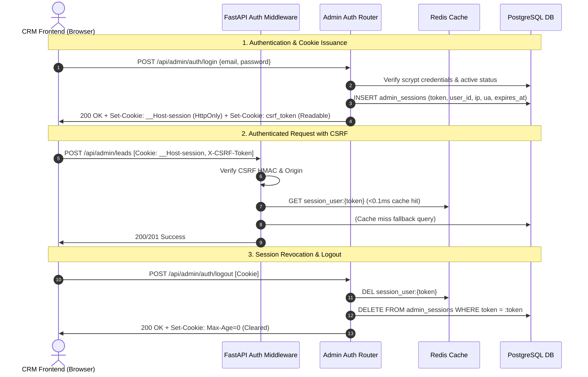

# Architecture: Authentication, Authorization & Contract Unification (Phase 5)

## 1. Overview & Security Objectives
Phase 5 eliminates client-side token handling in JavaScript by replacing legacy `localStorage` auth tokens with hardened, HttpOnly cookie sessions, signed HMAC-SHA256 CSRF protection, strict principal separation between human users and service API keys, and centralized public route contracts.

### Core Security Guarantees
1. **XSS Immunity for Session Credentials:** Session tokens are stored in `HttpOnly; SameSite=Lax; Path=/; Secure` cookies (`__Host-session` in HTTPS production, `admin_session`/`session` in development). JavaScript cannot read or exfiltrate session secrets.
2. **Double-Submit Signed CSRF Protection:** Mutating requests (`POST`, `PUT`, `PATCH`, `DELETE`) with session cookies require an `X-CSRF-Token` header matching the HMAC-SHA256 derived from the session identifier.
3. **Strict Principal Separation:** API keys are issued with `kind: "api_key"` and string ID `key:<id>`, while human staff have `kind: "user"` with integer ID. API keys cannot claim human record ownership in `check_resource_access` or `ensure_owns`, preventing IDOR vulnerability regressions.
4. **Actor-Tracking Audit Trail:** Audit logs and activity entries persist `actor_type` (`user` | `api_key`) and `actor_id` alongside user fields.
5. **Zero-Lockout Dual Mode Migration:** Backward-compatible `LEGACY_BEARER_AUTH=True` enables smooth zero-downtime deployment until legacy browser sessions expire.

---

## 2. Session Lifecycle Architecture



### 2.1 Login & Cookie Issuance
- **Endpoint:** `POST /api/admin/auth/login`
- **Session Token:** 64-character cryptographically secure hex string (`secrets.token_hex(32)`).
- **Session Lifetime:** Configured via `settings.SESSION_HOURS` (default: 12 hours).
- **Cookies Issued:**
  - `__Host-session` (or `settings.COOKIE_NAME`):
    - `HttpOnly: True`
    - `SameSite: Lax`
    - `Path: /`
    - `Secure: True` (in HTTPS production)
  - `csrf_token` (`settings.CSRF_COOKIE_NAME`):
    - `HttpOnly: False` (readable by client API client)
    - `SameSite: Lax`
    - `Path: /`
    - `Secure: True` (in HTTPS production)
- **Response Body:** Returns user profile with dynamic permissions, `kind: "user"`, `user_id`, and `csrf_token`.

### 2.2 Session Tracking & Inspection
- Database table `admin_sessions` tracks:
  - `id`: Serial primary key
  - `token`: Unique session token (hashed/indexed)
  - `user_id`: Foreign key to `users.id`
  - `ip_address`: Client IP resolved from proxy headers (`X-Forwarded-For` / `X-Real-IP`)
  - `user_agent`: Normalized browser user agent string
  - `last_seen_at`: Timestamp updated on activity
  - `expires_at`: Absolute session expiration
- Endpoints:
  - `GET /api/admin/auth/sessions`: Returns list of active sessions with device/IP metadata and `is_current` boolean.
  - `DELETE /api/admin/auth/sessions/{id}`: Revokes a specific session immediately.
  - `DELETE /api/admin/auth/sessions`: Revokes all other sessions except current.

### 2.3 Logout & Invalidation
- **Endpoint:** `POST /api/admin/auth/logout` or `DELETE /api/admin/auth`
- Session key deleted from Redis: `session_user:{token}`.
- Session record deleted from PostgreSQL `admin_sessions`.
- Cookies expired via `Max-Age=0` across all variants (`__Host-session`, `admin_session`, `session`, `csrf_token`).

---

## 3. Signed CSRF Defense Mechanism

### 3.1 Token Derivation
The CSRF token is derived deterministically from the user's active session token using HMAC-SHA256:
$$\text{CSRF Token} = \text{HMAC-SHA256}(\text{Key}=\text{SESSION\_SECRET\_KEY}, \text{Message}=\text{session\_token})$$

This formulation guarantees:
1. **Stateless Verification:** The backend does not need additional CSRF storage or database lookups.
2. **Session Binding:** A CSRF token derived for session $A$ cannot be used with session $B$.
3. **Cryptographic Secrecy:** Constant-time comparison via `hmac.compare_digest` prevents timing attacks.

### 3.2 Verification Rules
The `check_csrf(request)` routine enforces:
1. **Safe Methods Exemption:** `GET`, `HEAD`, `OPTIONS` requests bypass CSRF checks.
2. **Public Routes Exemption:** Declared public routes in `PUBLIC_BACKEND_ROUTES` bypass CSRF.
3. **Service Account Exemption:** Requests authenticated solely via API key (`X-API-Key`, `X-Client-Key`, or `Bearer rup_...`) or legacy Bearer tokens bypass CSRF.
4. **Origin Defense in Depth:** When an `Origin` or `Referer` header is present, it is verified against allowed origins (CORS list, apex domain, subdomains, Vercel deployments).
5. **Header Validation:** The incoming `X-CSRF-Token` header must match `generate_csrf_token(session_cookie)`. If missing or invalid, an HTTP 403 Forbidden is returned.

---

## 4. Principal Separation & Authorization Model

### 4.1 Principal Structure
```python
class AuthUser:
    id: int
    name: str
    email: str
    role: str
    kind: str  # "user" | "api_key"
    is_api_key: bool
    api_key_id: Optional[int]
    user_id: Optional[int]  # None for API keys!
    permissions: Dict[str, str]
```

### 4.2 Resource Ownership & IDOR Protection
In `check_resource_access` (`backend/app/core/permissions.py`) and `ensure_owns` (`backend/app/core/authz.py`):
- API keys are evaluated strictly by permission scope (`"all"`).
- An API key with database ID `42` (`api_key_id=42`) has `user_id=None`. It can **never** match a resource owned by human user `42` (`creator_id=42` or `assigned_to=42`).
- Any attempt by an API key to access user-scoped records raises `Forbidden("API keys cannot access user-scoped records. Only scope 'all' is permitted.")`.

### 4.3 Actor Tracking in Audit Logs
Every audit entry in `audit_logs` records:
- `actor_type`: `"user"` | `"api_key"`
- `actor_id`: `str(user.id)` for human users, or `f"key:{api_key_id}"` for API keys.
- Ensures forensic fidelity across human and automated actions.

---

## 5. Shared Contracts & Public Routes Registry

### 5.1 Backend Route Registry (`backend/app/core/public_routes.py`)
- `PUBLIC_EXACT_ROUTES`: Routes matching exact paths (e.g. `/`, `/health`, `/api/admin/auth/login`).
- `PUBLIC_PREFIX_ROUTES`: Public tree namespaces (e.g. `/api/public`, `/api/developer`, `/api/contact`, `/api/estimate`, `/api/contract/sign`, `/static`).
- Prevents accidental exposure of authenticated admin sub-routes (e.g., `/api/admin/auth/sessions`).

### 5.2 Frontend Route Registry (`crm/src/shared/api/publicRoutes.ts`)
- `CRM_PUBLIC_PAGES`: `['/login', '/accept-invite', '/contract/sign', '/changelogs']`
- `CRM_PUBLIC_API_ENDPOINTS`: `['/auth/login', '/public/invitations', '/public/contracts', '/contract/sign']`
- Synchronized between backend and frontend to eliminate route drift.

---

## 6. Frontend Authentication Client (`crm/src/lib/api.ts` & `client.ts`)

1. **Storage Purge:**
   - All references to `localStorage.setItem('crm_auth_token', ...)` and `localStorage.setItem('crm_user', ...)` have been purged.
   - Self-executing cleanup runs once on module load:
     ```typescript
     try {
       localStorage.removeItem("crm_auth_token");
       localStorage.removeItem("crm_user");
       sessionStorage.removeItem("crm_auth_token");
       sessionStorage.removeItem("crm_user");
     } catch {}
     ```
2. **Automatic CSRF Injection:**
   - `fetch()` requests include `credentials: "include"`.
   - Mutating methods automatically attach `X-CSRF-Token: getCsrfToken()`.
3. **Session Hydration:**
   - On app startup, `AuthContext` calls `api.getMe()` to hydrate user state directly from the server session.
   - Routing guards remain in a loading state (`isHydrating=true`) until `getMe()` finishes, preventing premature route redirects.

---

## 7. Rollout, Operations & Rollback Levers

### 7.1 Production Rollout Sequence
1. **Deploy Backend:** Runs with `LEGACY_BEARER_AUTH=True`. Sets session cookies on login and accepts either cookie or Bearer tokens.
2. **Deploy Frontend:** Switches entirely to cookie authentication with CSRF tokens.
3. **Telemetry Window:** Monitor server logs for incoming requests with `auth_method: bearer`.
4. **Decommission Legacy Mode:** Set `LEGACY_BEARER_AUTH=False` in backend environment.
5. **Session Revocation:** Run `DELETE FROM admin_sessions WHERE created_at < NOW() - INTERVAL '12 HOURS'` to clean expired sessions.

### 7.2 Emergency Rollback
If an unexpected edge-case occurs with browser cookie transmission:
1. Revert backend config `LEGACY_BEARER_AUTH=True` (no database migrations or schema rollback required).
2. Redeploy previous frontend artifact or set feature flag `VITE_LEGACY_BEARER_FALLBACK=true`.
