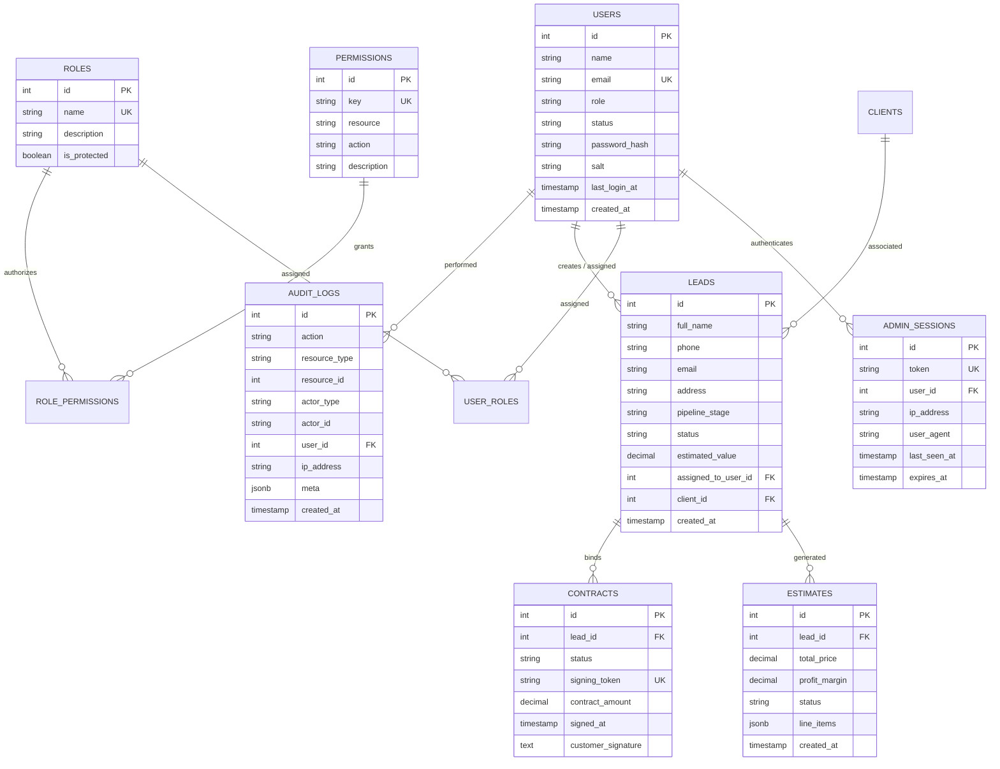

# Architecture: Relational Data Model & Migration Conventions

## 1. Entity Relationship Diagram (ERD)

---

## 2. Zero-Downtime Migration Conventions (Expand / Contract)

Database schema alterations must follow the **Expand / Contract** pattern to allow zero-downtime rolling deployments:

### Phase 1: Expand (Safe Addition)
1. Add new columns as **nullable** or with a safe database default.
2. Create indexes concurrently (`CONCURRENTLY` in PostgreSQL).
3. Do not drop old columns or rename active columns in the same release.

### Phase 2: Migrate & Dual-Write
1. Update application code to read from new columns and write to both old and new columns.
2. Deploy backend and frontend application servers.

### Phase 3: Contract (Safe Deprecation)
1. Once old code is no longer running in any cluster, run a final migration to drop deprecated columns or enforce `NOT NULL` constraints.
2. Remove fallback code branches.

---

## 3. Migration Guidelines
1. **Never run migrations during application container startup:**
   - Migrations are executed as an isolated release phase command (`alembic upgrade head`) before shifting traffic.
2. **Deterministic Version Ordering:**
   - Every Alembic migration must have a clear descriptive revision ID and message.
3. **Rollback Safety:**
   - Always implement both `upgrade()` and `downgrade()` methods in Alembic version files.
