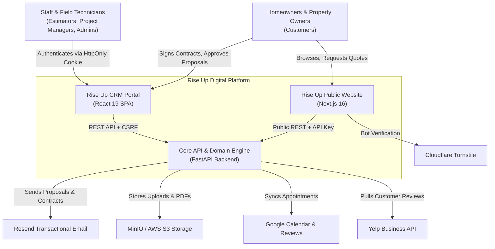
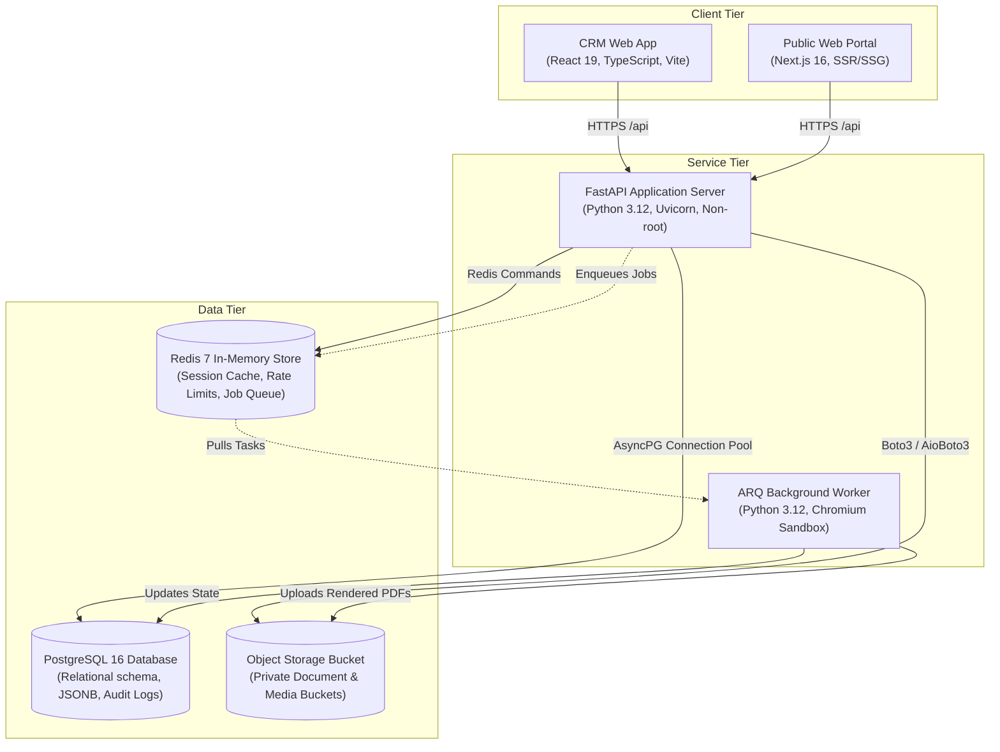

# Architecture: System Overview & C4 Model

## 1. System Context Diagram (Level 1)
Describes how users and external systems interact with the Rise Up Roofing platform.

---

## 2. Container Diagram (Level 2)
Describes the high-level technical building blocks that make up the platform.

---

## 3. Security Boundaries & Trust Zones
1. **Public Zone (Untrusted):** Internet traffic originating from browsers or external webhooks. All input is strictly validated via Pydantic schemas; Cloudflare Turnstile blocks automated submission attacks.
2. **DMZ (Reverse Proxy):** Cloudflare / Nginx terminates TLS, verifies SSL certificates, applies DDoS protection, and forwards clean requests with `X-Forwarded-For` and `X-Request-Id`.
3. **Internal Application Zone:** FastAPI application and ARQ workers operate in isolated container runtimes. API keys are authenticated via constant-time hashes; staff sessions are verified via Redis and PostgreSQL.
4. **Data Isolation Zone:** PostgreSQL and Redis containers do not publish ports to the public internet. Access is restricted to the internal Docker bridge network.
