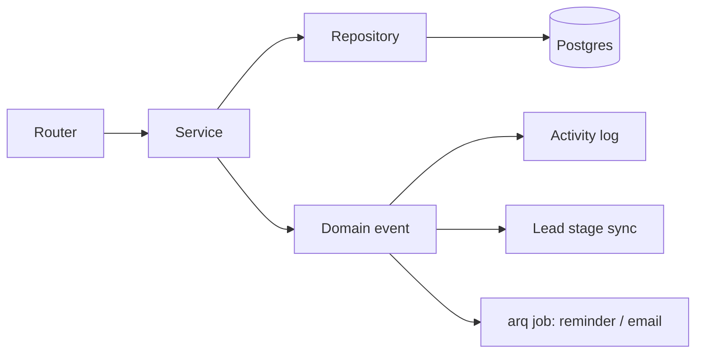

# P3: Backend Restructure

**Goal:** Move from "SQL and workflows inside route handlers" to a layered, typed, testable backend: **router → service → repository**, with one error taxonomy, one transaction model, Alembic as the only schema path, and every P2 strict-xfail resolved.

**Prerequisites:** P2 exit criteria met (HTTP tests for every route, authz matrix, characterisation snapshots).

**Delivers toward 10/10:** Backend Layering, Duplication, Complexity, Validation, Error handling, Async/Transactions, Data/Migrations, Security (remaining items), Testing (to ≥85%).

---

## Target structure

```
backend/app/
  api/v1/<domain>/router.py        # thin: parse → authz dependency → call service → return schema
  domain/<domain>/
    schemas.py                     # Pydantic in/out models
    service.py                     # business rules, workflows; raises DomainError
    repository.py                  # all SQL; no business rules, no HTTP types
    events.py                      # domain events + handlers
  core/
    errors.py  authz.py  uow.py  config.py  logging.py  security.py  redis.py
  shared/
    activity.py  numbering.py  pagination.py  partial_update.py  storage.py  money.py
```

**Domain event flow** (replaces the "estimate sent → move lead → schedule reminder → insert activity" block currently copy-pasted in `estimates.py` ×3 and `pipeline.py`):



## The recipe (applied to every domain)
1. **Confirm** the domain's characterisation tests and xfails from P2 are present.
2. **Schemas:** define request models with `ConfigDict(alias_generator=to_camel, populate_by_name=True, extra="forbid")`; response models with explicit fields (no `SELECT *` leaking columns); `Decimal` for money; `StrEnum` for statuses/stages/priorities.
3. **Repository:** move each SQL statement into a named method (`get_by_id`, `list_scoped`, `update_fields`, `insert_activity`). Keep hand-written SQL where it earns its place (reporting, pipeline LATERAL joins) but parameterised and unit-tested; use ORM for plain CRUD.
4. **Service:** move rules and workflows; take a `Principal` and a unit of work; raise `NotFound`, `Forbidden`, `Conflict`, `ValidationFailed`; emit domain events.
5. **Router:** ≤25 lines per handler; permission via `Depends(require("x.edit"))`; **ownership via `ensure_owns` inside the service**, so it can't be forgotten; `response_model` on every route.
6. **Delete** the old code, remove the module from mypy `ignore_errors` and from the ruff baseline, lower the ratchet numbers, flip the domain's `xfail`s.
7. **Verify:** domain tests green, snapshots unchanged (or changed deliberately and explained), staging smoke test.

A domain is **done** only when: no SQL in its router, no function >60 lines, no `except Exception: pass`, every route typed, authz matrix rows for it all pass, mypy strict passes for it.

---

## WP-3.1: Shared kernel (build first; everything else depends on it)

1. **`core/errors.py`:** `DomainError(code, message, details)` and subclasses `NotFound`, `Forbidden`, `Conflict`, `ValidationFailed`, `Unauthenticated`, `ExternalServiceError`. One exception handler in `main.py` maps them to `{"error": {"code", "message", "details"}, "requestId"}`; unexpected exceptions are logged with the request ID and return a generic 500. Keep a compat shim so the existing `{ok, error, detail}` shape the frontend relies on keeps working until P4 switches to the new one (document this).
2. **`core/authz.py`:** a `Principal` dataclass (`id`, `kind: user|api_key`, `role`, `permissions`, `scope_for(permission)`); `require(permission)` dependency; `ensure_owns(principal, resource, permission)` implementing own/assigned/all scope and owner bypass; one permission naming scheme (`resource.action`: remove the `:` variants from `permissions.py:20` normalisation by migrating callers).
3. **`core/uow.py`:** one `AsyncSession` per request (existing `get_db` semantic), explicit `commit()` at the end of a service call, and **no** commits inside repositories. `begin_nested()` helper for savepoints. Forbid sharing a session across `asyncio.gather` (document; lint by code review plus a test using separate sessions).
4. **`shared/activity.py`:** `log_activity(uow, entity, entity_id, action, actor, metadata)`. Replace every inline `INSERT INTO activities`. The actor comes from the `Principal`, **never** from the request body (fixes audit-log spoofing via `authorName` / `authorRole`).
5. **`shared/partial_update.py`:** `build_update(table, allowed_columns, changes)` returning a parameterised statement from a column allow-list. Replaces about 15 copies of the dynamic `UPDATE ... SET` builder.
6. **`shared/numbering.py`:** `next_document_number(uow, "estimate"|"job")` using Postgres `SEQUENCE`s (migration in WP-3.12) → `EST-2026-0001`. Removes the `COUNT(*)+1` race.
7. **`shared/pagination.py`:** `Page[T]`, `PageParams(limit<=100, cursor/offset)`, helper for keyset pagination.
8. **`shared/money.py`:** `Decimal` helpers and a Pydantic `Money` type (quantised to 2 places); never `float` for money.
9. **`core/logging.py`:** `structlog` JSON logging, request-ID middleware (`X-Request-ID`), user ID in context, correct log levels (fix `logger.error` used for timing messages, the `logger.error("...:\n", tb)` format bug in `estimates.py:695`).
10. Unit-test every helper (these are the most reused code in the codebase).

**Acceptance:** helpers are 100% covered; mypy strict passes for `core/` and `shared/`.

---

## WP-3.2: Leads domain (`leads.py`, 728 lines)
- Split `update_lead` (~274 lines) into service methods: `update_fields`, `change_stage`, `assign`, `mark_lost`.
- Replace `request.json()` at `leads.py:766` with a schema; take author from `Principal`.
- Replace the duplicated column/alias handling (`assigned_to` vs `assigned_to_user_id`, `lead_source` vs `source_type`) with one canonical field in the schema (compat aliases accepted on input, one on output).
- Pagination and server-side filtering for the list endpoint.
- Flip the related xfails.

## WP-3.3: Pipeline (`pipeline.py`, 1,347 lines)
- `get_sales_pipeline` (~458 lines) becomes: repository query for lead cards (LATERAL joins kept, covered by tests), repository query for checklist (restricted to the returned leads, not the whole table), and a service that assembles columns. **Paginate per stage**; the response keeps a compatible shape plus a `nextCursor` per column.
- `_process_stage_update` (~313 lines) → a `PipelineService.move(lead, to_stage, actor, reason)` with a table-driven transition rules map and domain events (`LeadStageChanged`).
- **Do not** auto-mark contracts `signed` on moving to `contract_signed` (`pipeline.py:870-880`); signing happens only through the signing flow. Replace with a validation that a fully executed contract exists, else `Conflict`.
- Remove `request.json()` usage at `:788` and the body-supplied author fields at `:816-817`.

## WP-3.4: Estimates (`estimates.py`, 1,735 lines — the largest)
- Split into `estimates/` (CRUD + pricing), `estimate_documents` (PDF, upload, send), `estimate_conversion` (to job).
- Create/update use the real schemas (no more dict-style access); client resolution via `ClientService.find_or_create` returning a typed result.
- `EstimateSent` event handler owns the lead-move, reminder and activity logic (delete the three copies).
- **Uploads service (`shared/storage.py`):** size cap (configurable), allow-listed content types **validated by magic bytes** (`filetype`/`python-magic`), server-generated names, `Content-Disposition` safe, async writes (`aiofiles` or S3), no trust in the client MIME. Apply to estimate photos, uploaded estimate PDFs (reject `application/octet-stream` unless magic bytes say PDF; stream with a limit instead of reading 50 MB into memory), hero banner images and avatars (validate `avatar_url` is an internal storage path).
- Numbering via `next_document_number`. Remove hard-coded prices (`:768-776`, fallback total 26870): load from pricing settings and fail loudly if missing.
- Remove margin-stripping duplication (`:141-144`, `:424-427`) into one serializer based on permission (response schemas per audience).
- Ownership: `get`, `update`, `convert`, `pdf` use `ensure_owns` (flip IDOR xfails).

## WP-3.5: Contracts (`contracts.py`, 1,178 lines)
- Ownership checks on all 13 routes.
- Draft edits require an **edit** permission and are rejected when status is `sent`/`partially_executed`/`fully_executed` (409). Real `version` handling with optimistic concurrency (`If-Match`/version field).
- State machine class for statuses `drafted → sent → partially_executed → fully_executed` (+ `voided`), with allowed transitions in one place and an audit event for each.
- `signing_token`: separate model/endpoint; never returned by list/draft-by-lead for callers without the send permission; signing tokens stored hashed with expiry.
- Move PDF rendering to a service; reuse the datetime→ISO serialiser via response schemas instead of the two copy-pasted loops.
- Public signing routes (`public_contracts`): rate limit, token-only access, no internal fields.

## WP-3.6: Clients (`clients.py`, 1,375 lines)
- Client 360 (`:841-939`): replace the concurrent `gather` on one session with sequential repository calls (or one SQL query for related counts); keep the response shape.
- Remove writes from GET (`?sync=true` → `auto_heal_dataflow_sync`): make it an explicit `POST /clients/{id}/sync` or run it as a background job.
- Fix the permission mismatch (`clients.py:134` uses `leads.view` while the route requires `clients:view`); one canonical permission.
- Eliminate N+1 loops at `:1257`; add pagination and an allow-listed sort map into the repository.
- `create_existing_client` (~283 lines) → `ClientImportService` with steps and tests.

## WP-3.7: Calendar (`calendar.py` + `calendar_events.py`)
- Merge into one calendar domain. **Use `calendar_events.py` as the model** (it already uses ORM, `response_model` and owner filtering).
- Break up `get_calendar_events` (446 and 339 lines): repository queries per event source, service merges and sorts.
- Replace the module-level `ZoneInfo("America/Los_Angeles")` with a `settings.COMPANY_TIMEZONE` and a helper (and make sure `tzdata` is pinned; done in P1).
- Fix `UpdateCalendarEventPayload`, `CreateTaskPayload` and `UpdateTaskPayload` import failures flagged by the tests that failed in the local run.

## WP-3.8: Reports and Marketing (`reports.py`, `marketing.py`)
- Each report becomes a named repository query with a typed result schema and a test with seeded data. Shared date-range parsing/validation helper (`DateRange`, regex-validated, `CAST(:x AS DATE)` binds).
- **Remove fake fallbacks** (`reports.py:897-909` made-up insights on failure): return a proper 502/500 or an empty typed result with `status="unavailable"`; never invent numbers.
- `marketing.py:526-540`: replace f-string `uid` interpolation with a bind parameter.
- Break up `get_analytics` (~356) and `get_stats` (~279) into composable queries; cache results in Redis with an explicit key and TTL where useful.

## WP-3.9: Remaining routers
Apply the recipe to: `system.py`, `rbac.py`, `finances.py`, `jobs.py`, `field.py`, `estimator.py`, `signatories.py`, `hero_banners.py`, `quote_banner.py`, `user_tasks.py` (already good; adjust), `audit.py`, `auth.py`, `integrations.py`, `developer.py` (1,084 lines: split into API keys / sessions / console / redis browser), public routers.

Specific fixes:
- **`system.py`:** the `/export` endpoint must apply scope filters; the company profile (`:107-126`) comes from the database, not a hard-coded dict; `f"SELECT COUNT(*) FROM {t['name']}"` stays only behind an allow-list constant (keep, with a comment and test).
- **`rbac.py`:** schemas for every endpoint (the remaining 5 `request.json()` calls at `:185, 240, 344, 385, 459`), N+1 fixes at `:212`/`:276`, owner-only protections from P0 become service rules.
- **`finances.py`, `jobs.py`, `field.py`:** per-record ownership checks; number generation via sequences; shared `build_update`.
- **`developer.py`:** replace `redis.keys()` with `SCAN`; stop returning session data previews; `kill_session` must report failure; remove dead `/tools/query`; hash `admin_sessions.token`.
- **`/docs`, `/redoc`, `/openapi.json`:** disabled in production or protected.
- **Preferences endpoint** (needed by P4.3): `GET/PUT /me/preferences` (hero banner, quote banner, weather settings, UI prefs) stored as a JSONB column with a Pydantic schema.

## WP-3.10: Cross-cutting infrastructure

1. **Authentication caches:** remove the per-process dictionaries as an authority (`core/redis.py` local cache, `_in_memory_dev_sessions`). Redis is the only cache, with a short TTL; invalidate on logout, deactivation and role change with explicit `DEL` plus pub/sub for any remaining local memo. With Redis down: fail closed for auth and rate limiting in production (documented), fall back only in dev/test.
2. **Session tokens:** store SHA-256 of the token in `admin_sessions.token_hash` (migration: expand → dual-read → contract); developer sessions the same.
3. **Client IP:** a `TRUSTED_PROXIES` setting; honour `X-Forwarded-For`/`cf-connecting-ip` **only** when the immediate peer is trusted. Use it for rate limiting, audit and developer brute-force protection.
4. **Rate limiting:** apply the limiter consistently to login, public forms, signing and developer auth.
5. **Background jobs (arq):** move email sending, PDF generation, review requests and reminders into arq tasks with retry/backoff and idempotency keys. Keep references to any remaining `asyncio.create_task` (or replace them with arq/lifespan-managed tasks); run startup backfills and snapshot jobs once via a Redis leader lock instead of in each of the 4 workers.
6. **Integrations:**
   - Turnstile: fail **closed** in production on timeout or error (fail open only in dev/test; configurable), with a clear log.
   - Weather: pass `params=` to httpx (URL-encoded), key in a header if supported, typed result and cached; remove the hard-coded fallback date.
   - Email: one `EmailClient` with timeout, retries, typed errors; move inline HTML f-strings into Jinja templates under `templates/email/` with autoescape; escape subjects; single place for the Resend key lookup.
   - Reviews service: no `db.commit()` inside services; use the unit of work.
7. **PDF service:** close the browser in `try/finally`; intercept requests with `page.route` to allow only data URIs and the internal asset host (blocks SSRF); remove `--no-sandbox` where the container allows non-root sandboxing, otherwise document the compensating controls; compute defaults like `proposal_date` at call time; store PDFs in **private S3/MinIO** under unguessable keys and serve through short-lived presigned URLs or an authenticated download endpoint; stop mounting `/static/uploads/estimates` publicly.
8. **CORS:** one policy in one place (`main.py`), configured from `settings.CORS_ORIGINS`; remove the production `localhost` regex and the separate hand-rolled error-handler CORS logic.
9. **Health:** `/health` (liveness), `/ready` (DB + Redis + migrations at head).

## WP-3.11: Tests per domain (continuous)
- Move each domain's characterisation tests along with the code; add service-level unit tests (pure Python, in-memory fakes of repositories where they speed things up) for state machines, transition rules, numbering, money math, and scope logic.
- Add concurrency tests: two concurrent estimate creations never share a number; two concurrent stage moves don't corrupt state.
- Add upload tests (oversize, wrong magic bytes, double extension).
- Keep the authz matrix as the gate: **`be.authz_xfails` must reach 0**.

## WP-3.12: Data model and migrations
1. **Reconcile Alembic:** dump the **production** schema; restore it to a scratch DB; run `alembic revision --autogenerate` against the models to produce `0002_reconcile`; hand-review (watch for destructive operations). Include `spam_attempts` (add the model). Prove: `alembic upgrade head` on an empty DB equals the production schema (`alembic check` clean, and a `pg_dump --schema-only` diff).
2. Delete competing schema paths: `create_tables.py`, `migrate_events.py`, `scratch/run_migration.py`, `scripts/add_spam_attempts_table.sql`, and the startup `CREATE TABLE` in `main.py`. RBAC seeding becomes an idempotent management command (`python -m app.cli seed-rbac`) run as a release step, not on every app start.
3. **Constraints (expand/contract migrations):**
   - `contracts.lead_id`/`estimate_id` → `ON DELETE RESTRICT` (or soft-delete on leads/estimates with `deleted_at`); signatures and audit events never cascade-delete.
   - CHECK constraints or PG ENUMs for statuses, stages, priorities, roles.
   - `NUMERIC(12,2)` for all money columns (`estimated_value`, prices, payments); migrate with `USING col::numeric(12,2)`.
   - Sequences for document numbers.
4. **Remove duplicate columns** across multiple releases, never in a single step:
   `leads.assigned_to`/`assigned_to_user_id`, `created_by`/`created_by_user_id`, `lead_source`/`source_type`; `users.role`/`permissions` array vs RBAC tables. For each: *expand* (add canonical, backfill, write both) → *migrate readers* → *stop writing the old* → *contract* (drop) in a later deploy, after a verified backup.
5. Add relationships to ORM models where repositories use ORM; migrate `ApiKey` to `Mapped[]` style.
6. Add the missing indexes found by `EXPLAIN (ANALYZE, BUFFERS)` on the slowest list queries (pipeline, leads list, activity feed).
7. CI: `alembic upgrade head && alembic check`, plus an upgrade-from-previous-release test.

---

## Exit criteria for P3
- [ ] `be.sql_in_api == 0`; import-linter forbids it permanently
- [ ] `be.except_exception` ≤ a small justified set (each with a comment and logging); `S110/BLE001` clean
- [ ] No backend function >60 lines, no file >400 lines (ratchet)
- [ ] 100% of routes have typed request and `response_model`; no `request.json()`
- [ ] `be.authz_xfails == 0`; route-inventory and authz matrix green
- [ ] Alembic is the only schema path; `alembic check` clean in CI
- [ ] Contracts can't be cascade-deleted; money is `NUMERIC`; statuses constrained
- [ ] mypy strict across `app/` with no `ignore_errors` overrides
- [ ] Uploads validated; PDFs private; no internal errors returned to clients
- [ ] Coverage ≥85% line / ≥75% branch
- [ ] ruff per-file-ignore baseline is empty
- [ ] OpenAPI schema is complete and accurate (input to P4.1)

## Hand-off to P4
Publish `openapi.json` as a CI artifact; list every response-shape change made in P3 (with the compat shims still in place) so the frontend can migrate in P4.
